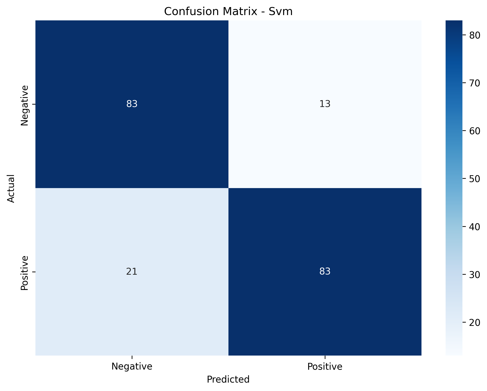

# nlp_sentiment_analysis


# Preprocessing Methodology
In this assignment, we used 2-stage text preprocessing:

# External preprocessing:
For this stage, I lowercased the whole text, removed punctuation, and parentheses. I
chose these characters because the dataset contained a lot of words in CAPS LOCK,
excessive punctuation, like “good!!!!!”
, and some parentheses at the end of the
sentences. While removing these, I inserted whitespaces instead of them to keep the
words apart for the next step.

# Internal Pipeline preprocessing:
In this stage, I was confused about what method to use. First, I thought about using
lemmatization to ease the model’s job in classifying words. However, I faced a challenge
that lemmatization in NLTK did not work properly without proper POS-tagging. Then, I
implemented the POS tags and tokenization in the pipeline, but it still resulted in
incorrect lemmatization of some words like “was” -> “wa”. After this, I decided to use
SpaCy’s lemmatizer. It turned out to be heavy and slowed down the whole computation
process. In the end, I ended up using TextPreprocessor with Negation Handling. I
believe that this preprocessing step gives the model a better understanding of the
sentiment and handles shortened words, such as “won’t” . The last approach also
improved the accuracy by 4% compared to the lemmatization methods.

# Model Selection and Hyperparameter Tuning
Three distinct classification models were evaluated: Logistic Regression, Multinomial Naive
Bayes, and a Support Vector Machine (SVM).
I used GridSearchCV to find the best model + hyperparameters combo. The search
systematically tested:
● Vectorizers: Both CountVectorizer and TfidfVectorizer.
● Tokenizer Parameters: ngram_range (up to trigrams), token_pattern, document
frequency (max_df, min_df), and the use of stop words.
● Model Hyperparameters: Regularization strength (C) for Logistic Regression and SVM,
and the smoothing parameter (alpha) for Naive Bayes.

The best model was SVM with TfidfVectorizer, with accuracy of 83%. I believe it is because
TF-IDF is good in identifying important words for the sentiment (it was a top performer in every
model), and SVM is efficient in using it.

# Final Results

The SVM model, paired with TfidfVectorizer, emerged as the top performer, achieving a final
F1-score of 0.83. This was the same for the Logistic Regression (0.83) and it outperformed
Naive Bayes (0.81) models. Overall, all 3 models were successful in pairing with TfidfVectorizer.



# Future Work

We extended this project to support **sentiment analysis for any product page** using **Flask**, **TextBlob**, and **BeautifulSoup**.  
The backend scrapes the page, extracts text, and runs sentiment analysis to classify it as *Positive*, *Negative*, or *Neutral*.  

### Installation

Make sure you have Python 3.8+ installed. Then install the dependencies:

```
pip install flask textblob requests beautifulsoup4
python -m textblob.download_corpora
```

Start the Flask server:
```
python sentiment_analysis.py
```

This will launch the app at http://127.0.0.1:5000
